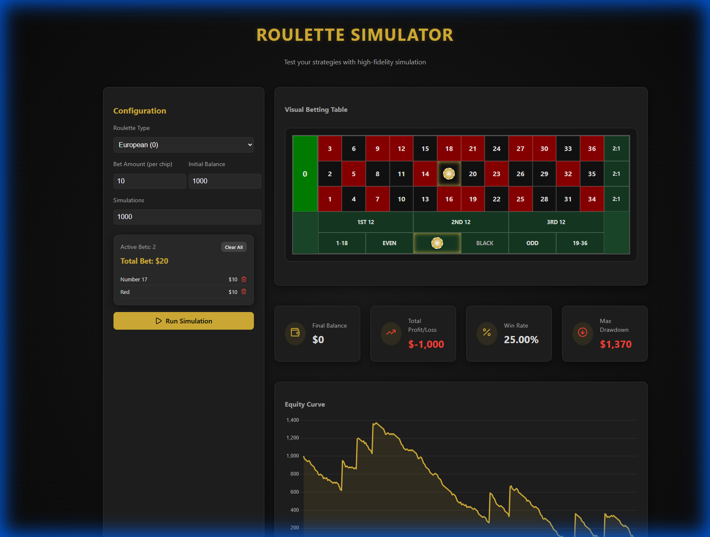
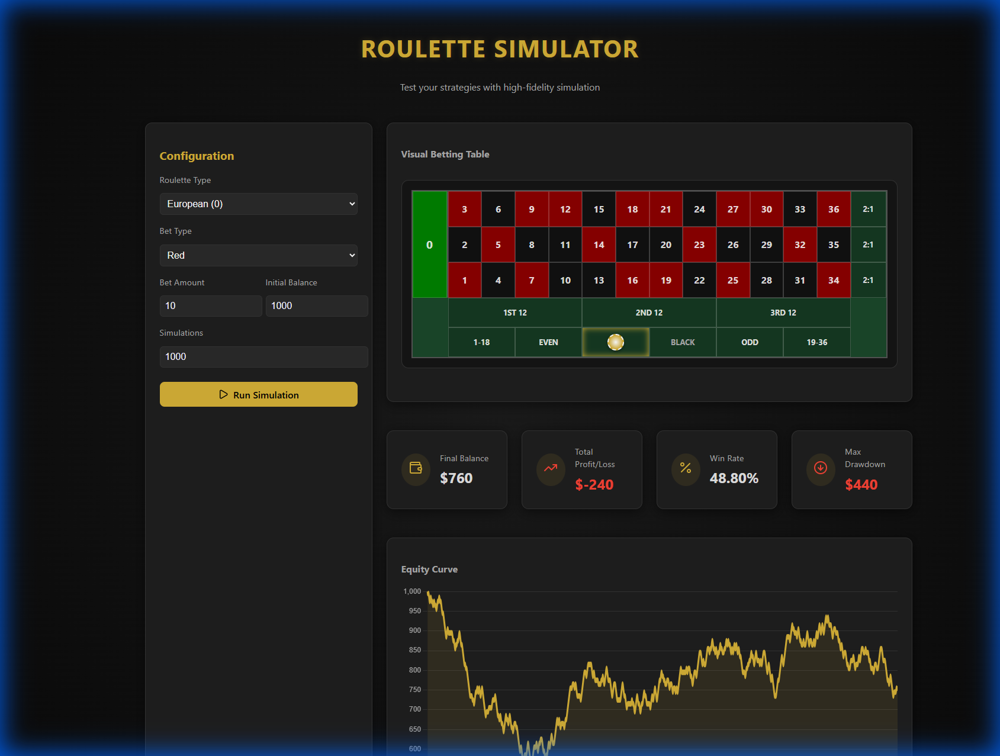
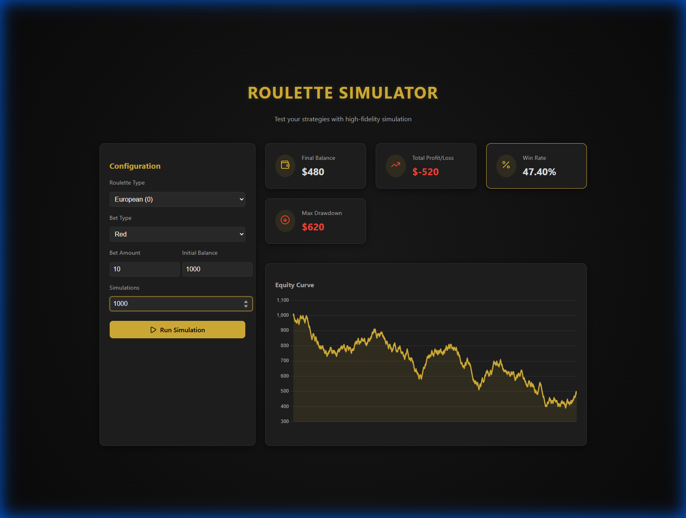
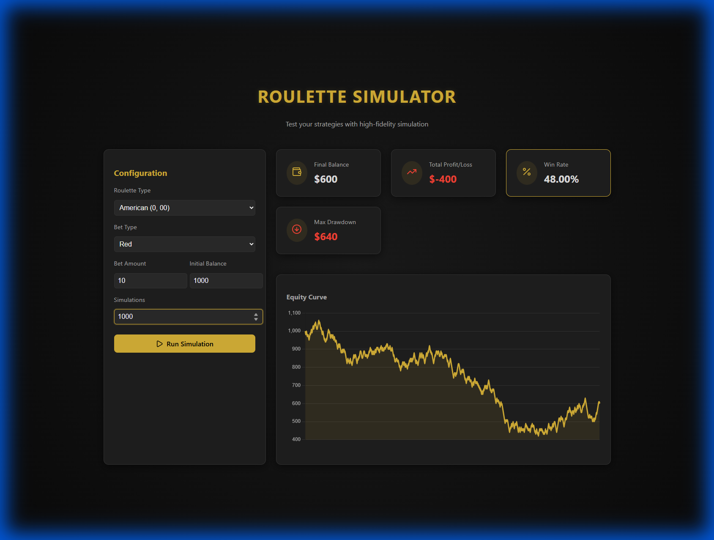

# Roulette Simulation Platform Walkthrough

I have successfully built a premium Roulette simulation platform that allows users to test various betting strategies across different roulette variants.

## Features Implemented

- **Multi-Bet Support**: Place multiple chips on the table simultaneously and simulate the combined outcome.
- **Visual Betting Table**: Interactive virtual table for placing bets by clicking on numbers or zones.
- **Multiple Roulette Variants**: Support for American (0, 00), European (0), and French (0 + La Partage rule).
- **Flexible Betting**: Support for Straight Up, Red/Black, Even/Odd, High/Low, and Dozens.
- **High-Fidelity Simulation**: Run up to thousands of iterations instantly.
- **Data Visualization**: Real-time equity curve chart using Chart.js.
- **Key Statistics**: Track Final Balance, Total Profit/Loss, Win Rate, and Max Drawdown.
- **Premium UI**: Dark mode casino theme with gold accents and smooth animations.

## Visual Demonstration

## Technical Implementation

### Core Logic
The simulation engine is located in [roulette.ts](../src/logic/roulette.ts). It handles the probability distributions for each roulette type and calculates payouts accurately, including special rules like *La Partage*.

### UI Component
The main application logic and UI are in [App.tsx](../src/App.tsx), utilizing `react-chartjs-2` for the equity curve and `lucide-react` for icons.

### Styling
The premium look and feel are defined in [index.css](../src/index.css), featuring a radial gradient background and custom gold color palette.
